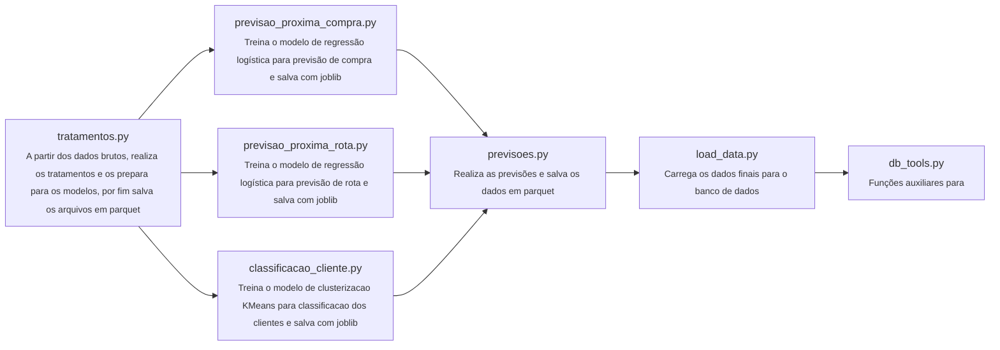

# Entregável técnico

# Algoritmos utilizados no projeto
Utilizamos códigos em python para realizar o tratamento, análise e previsão de comportamento de clientes da ClickBus, utilizando técnicas de machine learning para classificação de clientes, previsão de compra e previsão de rotas.

## Diagrama dos arquivos

## tratamentos.py
Nesta etapa inicial, preparamos a matéria-prima para toda a análise, garantindo a qualidade e a relevância das informações.
- Extração e Limpeza: Carregamos o histórico de vendas bruto e realizamos um tratamento rigoroso, convertendo e padronizando campos essenciais, como as datas de compra.
- Enriquecimento de Dados: Criamos novas informações valiosas a partir dos dados existentes, como a coluna "rota" (par origem e destino), que permite uma análise de jornada do cliente.
- Engenharia de Features (RFM): Para cada cliente, calculamos as métricas-chave de comportamento do consumidor:
    - Recência: Quando o cliente comprou pela última vez.
    - Frequência: Quantas vezes o cliente já comprou.
    - Valor Monetário: Quanto o cliente já gastou no total.
- Criação de Rótulos para Treinamento: Separamos os dados em períodos de "histórico" e "futuro" para validar a eficácia dos modelos e criamos o rótulo-alvo que indica se um cliente realizou uma compra nos 30 dias seguintes.

## previsao_proxima_compra.py
A partir dos dados tratados de clientes utilizamos o modelo de regressão ligistica para prever o target “comprou_30d”
O modelo é treinado e salvo com joblib.

## previsao_proxima_rota.py
A partir dos dados tratados de clientes e rotas (tabela com agrupamento composto por cliente e rota) utilizamos o modelo de regressão ligistica para prever o rótulo “comprou_rota”
O modelo é treinado e salvo com joblib.

## classificacao_clientes.py
A partir dos dados tratados de clientes utilizamos o KMeans, como modelo de clusterização para classificar os cliente
O modelo é treinado e salvo com joblib.

## previsao.py
Utilizamos os dados tratados e os modelos já treinados para fazer as previsões
- Classificação dos clientes
- Previsão de próxima compra
- Previsão de próxima
    - Ainda há uma etapa de tratamento para selecionar as rotas com as melhores probabilidade de cada cliente

## load_data.py

**Conexão com o banco**:
- Criamos a conexão chamando db_connection, que usa os parâmetros (usuário, senha, host, porta, nome do banco) vindos das variáveis de ambiente.

**Carregamento dos dados**:
- Lemos os arquivos Parquet (base_clickbus.parquet e clientes_clickbus.parquet).
Organizamos esses DataFrames em um dicionário chamado data.

**Execução do carregamento**:
- Chamamos iterative_load_data, que:
Limpa as tabelas no banco (TRUNCATE).
Carrega os dados atualizados de cada DataFrame.
Faz tudo isso dentro de uma transação atômica — garantindo que ou todas as tabelas são carregadas com sucesso, ou nenhuma é alterada (rollback em caso de erro).

# Persistência dos dados

A persistência dos dados neste projeto é realizada utilizando o banco de dados relacional PostgreSQL. Os dados finais, após tratamento e geração de previsões, são carregados para o banco por meio de scripts Python que utilizam a biblioteca SQLAlchemy para abstração e gerenciamento das operações de banco.

O processo de carga é feito de forma transacional e atômica: antes de inserir novos dados, as tabelas correspondentes são limpas (TRUNCATE), e os DataFrames são inseridos utilizando o método to_sql do pandas. Todo o procedimento ocorre dentro de uma transação, garantindo que, em caso de erro, nenhuma alteração parcial seja mantida no banco (rollback automático). Isso assegura integridade e consistência dos dados.

O arquivo db_tools.py contém funções auxiliares para conectar ao banco e realizar a carga dos dados, facilitando a integração entre os scripts de processamento e o banco de dados.